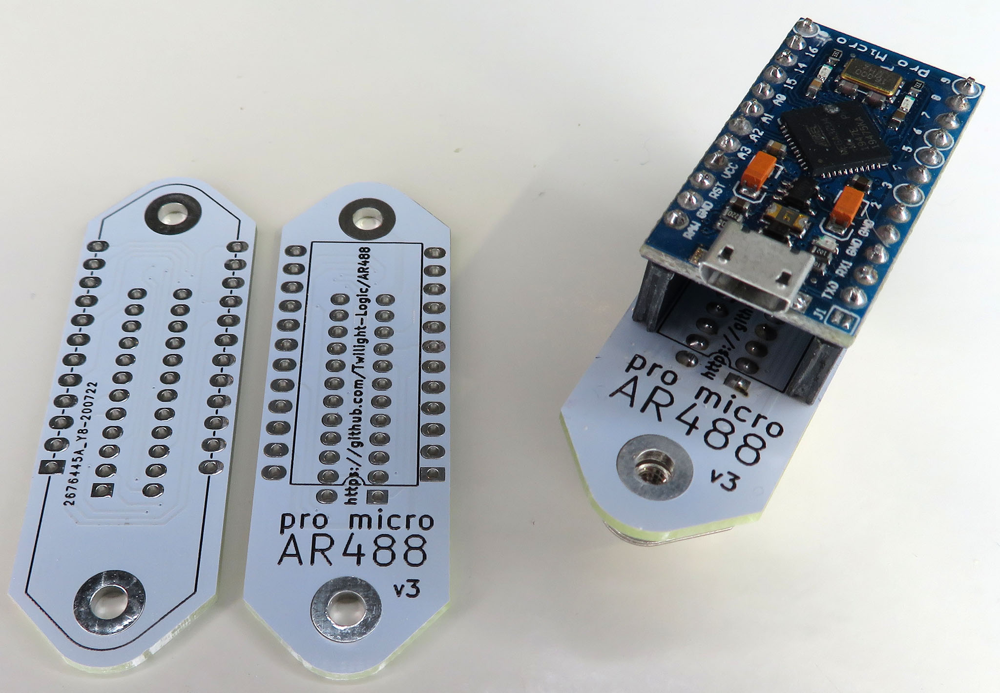

# AR488-build

Build of AR488 using Arduino Pro Micro & artag firmware.



Main repo: https://github.com/Twilight-Logic/AR488

Gerbers: https://www.eevblog.com/forum/projects/ar488-arduino-based-gpib-adapter/msg3362552/#msg3362552

(Mirrored in this repo)

Firmware: https://github.com/Twilight-Logic/AR488/tree/master/Contributed/artag

(Mirrored in this repo)

## Parts

Amazon: "Pro Micro Atmega32U4 5V 16MHz Bootloadered IDE Micro USB Pro Micro Development Board Microcontroller Compatible with Pro Micro Serial Connection with Pin Header"

SCSI plug: 111-024-113L001

## Download firmware

Using Arduino IDE (tested on 1.8.7)

Select "Arduino/Genuino Micro" as the board and short the RST/GND pins briefly during upload.

## Keithley 617

Commands to talk interfactively using Putty (115200 baud)

```
++verbose
++addr 29
++auto 1
F0X
F1X
```

F0X and F1X should generate some response from the device.

Command reference:

```
Function (F)
Range (R)
Zero Check (C)
Zero Correct (Z)
Suppress (N)
Trigger (T)
Voltage Source Operate (O)
Read Mode (B)
Display Mode (D)
Data Storage (Q)
SRQ Mode (M)
EOI and Bus Hold-off (K)
Terminator (Y)
```

Useful commands:

```
ClXZlXC0X - Zero check on, zero correct, zero check off
```
